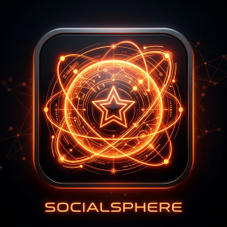

# 🚀 SocialSphere — Czarno-Pomarańczowa Platforma Społecznościowa



**SocialSphere** to nowoczesna, responsywna platforma społecznościowa z czarno-pomarańczowym motywem graficznym, systemem autoryzacji, weryfikacją kont, banami, ostrzeżeniami, natywną obsługą wielu urządzeń oraz centralnym serwerem.

Twórca i Właściciel: **Gabrys Rojewski (@Itzz_Sigma03)**

---

## 🌟 Główne Funkcje

* **⭐ Oficjalna Gwiazdka Weryfikacji ★**: Dedykowany badge weryfikacyjny przyznawany przez Właściciela.
* **🛡️ Panel Administracyjny Właściciela**: Pełne zarządzanie użytkownikami, weryfikacja, banowanie czasowe (TempBan 1h–30d / Perm), wydawanie ostrzeżeń i moderacja postów.
* **📍 Wykrywanie Multikont i IP**: Automatyczna detekcja kont rejestrowanych z tego samego adresu IP i urządzenia.
* **📣 Ogłoszenia Platformy**: Oficjalny kanał ogłoszeń z powiadomieniami dla wszystkich użytkowników.
* **🌌 Orbity (Reels / Stories)**: Dynamiczne pętlowe animacje canvas z wyborem motywów i tworzeniem własnych Orbit.
* **🔒 Bezpieczeństwo 2FA**: Dwuetapowa weryfikacja za pomocą zagadek bezpieczeństwa.
* **📱 Natywne Wydania**: Plik instalacyjny `.APK` dla Androida oraz `.EXE` (Installer / Portable) dla Windowsa.

---

## 🖥️ Uruchamianie Lokalnie i w Sieci LAN

1. **Uruchomienie serwera sieciowego:**
   ```bash
   node server.js
   ```
   lub dwukrotnie kliknij plik `UruchomServer.bat`.

2. **Dostęp z tego samego komputera:**
   `http://localhost:3000`

3. **Dostęp z innych urządzeń w sieci Wi-Fi:**
   `http://[TWÓJ_IP_LAN]:3000`

---

## ☁️ Wdrożenie w Chmurze z HTTPS (Render.com)

Aby uruchomić darmowy serwer dostępny dla każdego w internecie z szyfrowaniem **HTTPS**:

1. Wrzuć to repozytorium na własny **GitHub**.
2. Wejdź na [Render.com](https://render.com) i kliknij **New + -> Web Service**.
3. Połącz konto GitHub i wybierz repozytorium `SocialSphere`.
4. Ustawienia na Render.com:
   * **Build Command:** `npm install --omit=dev`
   * **Start Command:** `node server.js`
   * **Instance Type:** `Free` (Darmowy)
5. Otrzymasz gotowy darmowy link HTTPS (np. `https://socialsphere.onrender.com`).

---

## 📜 Licencja & Copyright
© 2026 SocialSphere by Itzz_Sigma03 — Wszystkie prawa zastrzeżone.
Zasady platformy: Zakaz treści 18+/NSFW, zero botów, wzajemny szacunek w społeczności.
